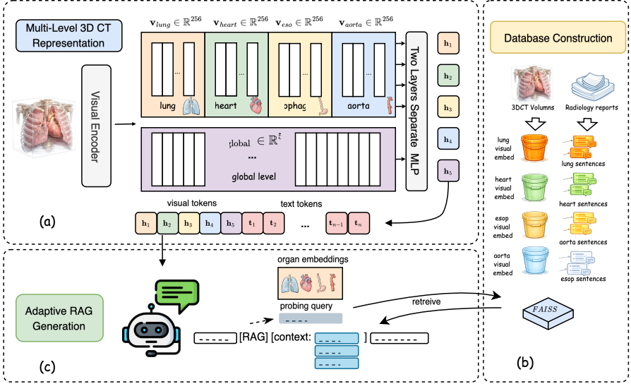

# AdaRAG-CT

AdaRAG-CT is a retrieval-augmented framework for 3D CT report generation. It augments CT representations with adaptive textual context to improve report quality.

Project repository: will be released after review.

## Overview



## Installation

```bash
conda create -n adaragct python=3.12
conda activate adaragct
pip install -r requirements.txt
```

## Data

- CT-RATE dataset: [ibrahimhamamci/CT-RATE](https://huggingface.co/datasets/ibrahimhamamci/CT-RATE)
- This repository is self-contained. Keep the directory structure unchanged after download.
- Training and inference dependencies are organized under `data/`.

## Repository Layout

```text
AdaRAG-CT/
├── data/
│   ├── embeddings/
│   │   ├── ct_clip/
│   │   └── visd_boost/
│   ├── oracle/
│   └── retrieval/
└── results/
    ├── base_8b/
    │   └── checkpoint/
    ├── base_70b/
    │   └── checkpoint/
    ├── adaragct_8b/
    ├── adaragct_70b/
```

## Results Summary

| Model | Clinical Precision | Clinical Recall | Clinical F1 | BLEU-4 | ROUGE-L | LLaMA Score |
|-------|--------------------|-----------------|-------------|--------|---------|-------------|
| Base 8B | 0.474 | 0.469 | 0.455 | 0.205 | 0.315 | 7.297 |
| AdaRAG-CT 8B | 0.502 | 0.520 | 0.480 | 0.242 | 0.354 | 7.747 |
| Base 70B | 0.522 | 0.395 | 0.414 | 0.208 | 0.316 | - |
| AdaRAG-CT 70B | 0.470 | 0.524 | 0.463 | 0.252 | 0.342 | - |

## Inference

```bash
python adaragct/inference/inference_rag.py --checkpoint results/adaragct_8b/checkpoint_step_2000 --output results/adaragct_8b/step_2000.jsonl
```

## Evaluation

```bash
python adaragct/eval/cal_metrics.py results/adaragct_8b/step_2000.jsonl --output results/metrics.json
```

## Training

```bash
python adaragct/train/train_rag.py --config configs/P10_rag_token_oracle07_noctx0_8b.yaml
```

The training and inference entry points expect the required oracle, retrieval, and embedding files to be present under `data/`.
The repository also includes the merged base model directories under `results/base_model/`, which are required by the released AdaRAG-CT checkpoints for training continuation and inference.

## Acknowledgements

- [CT-RATE / CT-CLIP](https://github.com/ibrahimethemhamamci/CT-CLIP)
- [ViSD-Boost](https://github.com/caohy123/ViSD-Boost)
- [LLaVA](https://github.com/haotian-liu/LLaVA)
- [Self-RAG](https://github.com/AkariAsai/self-rag)
